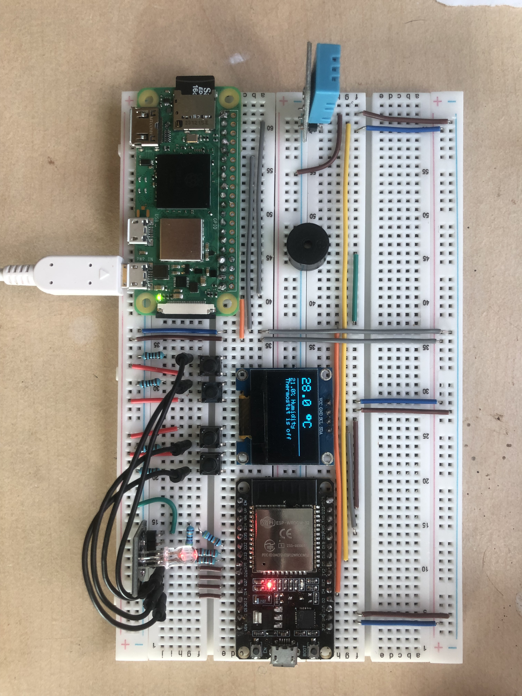

# IoT Thermostat System

A comprehensive IoT project that combines a microcontroller, a Raspberry Pi, and a Flask server to create a smart thermostat system. The system allows for local and remote control, offering a robust solution for temperature management.

## Project Structure

This project is organized into three main components, each residing in its respective folder:

### 1. `microcontroller-software`

**Microcontroller Thermostat**

- Built with ESP32 to monitor temperature and humidity using a DHT11 sensor.
- Features an OLED display, physical control buttons, RGB LED status indicator, and a buzzer for feedback.
- Provides a web API for remote control and monitoring.

#### Key Features:
- Real-time monitoring
- Physical and web-based controls
- Configurable running time with auto-shutdown
- Network connection via Wi-Fi hotspot

#### Key Endpoints:
- `GET /api/fetch_data`
- `POST /api/increase-target-temp`
- `POST /api/decrease-target-temp`
- `POST /api/increase-running-time`
- `POST /api/decrease-running-time`

#### Hardware Requirements:
- ESP32 microcontroller
- DHT11 sensor
- SSD1306 OLED display
- Buttons, RGB LED, and buzzer

#### Dependencies:
- DHT sensor library, WiFi library, ESPAsyncWebServer, ArduinoJson, Adafruit libraries

[Read more](microcontroller-software/README.md)

### 2. `raspberry-pi-setup`

**Raspberry Pi ESP32 Setup Script**

- Automates the setup of a Raspberry Pi as a secure Wi-Fi hotspot.
- Configures network services for seamless communication with the ESP32.
- Assigns a static IP to the ESP32 and installs necessary packages.

#### Key Features:
- Secure hotspot creation
- Network service configuration
- Static IP assignment for ESP32
- Logging for troubleshooting

#### Prerequisites:
- Raspberry Pi with Raspberry Pi OS
- Python 3.x
- Root/sudo privileges

#### Usage:
```bash
sudo python setup.py
```

[Read more](raspberry-pi-setup/README.md)

### 3. `web`

**Flask Server for ESP32 Thermostat**

- Python Flask server to control the ESP32 thermostat.
- Provides endpoints to fetch data and adjust settings.
- Periodically updates the server with real-time data from the ESP32.

#### Key Endpoints:
- `GET /` - Main page
- `GET /data` - Fetches current status
- `POST /button-press` - Adjusts thermostat settings

#### Prerequisites:
- Python 3.x
- Flask framework

#### Usage:
```bash
python app.py
```

[Read more](web/README.md)

## Project Description

This smart thermostat controller is designed to provide a user-friendly and efficient IoT solution for temperature management. It integrates hardware and software components, enabling users to monitor and control their environment through both physical interfaces and web applications.

The project consists of:
- **ESP32** for sensor data collection and physical controls.
- **Raspberry Pi** for network management and hosting the web application.
- **Flask server** for providing a web interface and API endpoints.

## Circuit Board Image



This image shows the circuit board configuration, essential for setting up the hardware components of the thermostat.

## License

This project is licensed under the GNU GPL v3.0.
